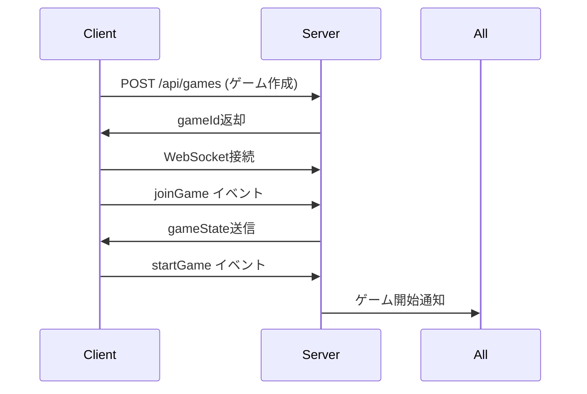
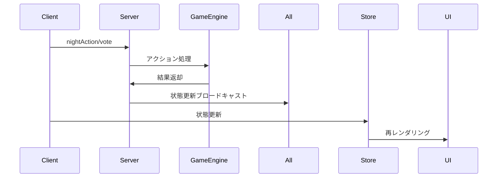

# Project JIN - Code Structure Documentation

## 概要

Project JINのコード構造と各ファイルの詳細な説明です。monorepo構成で、server・client・sharedの3つのワークスペースから構成されています。

## 全体のディレクトリ構造

```
AI-human-game/
├── docs/                    # 📚 プロジェクトドキュメント
│   ├── API_DOCUMENTATION.md
│   ├── FRONTEND_ARCHITECTURE.md
│   ├── DEVELOPMENT_GUIDE.md
│   └── CODE_STRUCTURE.md
├── server/                  # 🖥️ バックエンドサーバー
├── client/                  # 🌐 フロントエンドアプリ
├── shared/                  # 🔄 共通ライブラリ
├── package.json            # ルートパッケージ設定
├── README.md               # プロジェクト説明
├── CLAUDE.md               # 詳細な仕様書
└── .gitignore              # Git除外設定
```

## 📁 ワークスペース詳細

### 1. 🖥️ Server ワークスペース

**パス**: `/server/`

```
server/
├── src/
│   ├── game/              # ゲームロジック
│   │   ├── GameEngine.ts  # コアゲームエンジン
│   │   ├── GameManager.ts # ゲームセッション管理
│   │   └── index.ts       # ゲームモジュールエクスポート
│   ├── websocket/         # WebSocket通信
│   │   ├── SocketHandler.ts # Socket.IOイベント処理
│   │   └── index.ts       # WebSocketモジュールエクスポート
│   └── index.ts           # サーバーエントリーポイント
├── dist/                  # TypeScriptコンパイル結果
├── package.json           # サーバー依存関係
└── tsconfig.json          # TypeScript設定
```

#### 主要ファイル詳細

##### `src/index.ts` - サーバーエントリーポイント
```typescript
// 主な役割:
// - Expressアプリケーションの初期化
// - Socket.IOサーバーの設定
// - REST APIエンドポイントの定義
// - CORS設定
// - WebSocketハンドラーの初期化

主要なエンドポイント:
- GET /health          # ヘルスチェック
- POST /api/games      # ゲーム作成
- GET /api/games/:id   # ゲーム状態取得
```

##### `src/game/GameEngine.ts` - コアゲームエンジン
```typescript
// 主な機能:
// - ゲーム状態の管理
// - プレイヤーの追加・削除
// - 役職の割り当て
// - 夜行動の処理
// - 投票の処理
// - 勝利条件の判定
// - フェーズ進行の管理

主要クラス: GameEngine
主要メソッド:
- addPlayer()          # プレイヤー追加
- startGame()          # ゲーム開始
- executeNightAction() # 夜行動実行
- castVote()           # 投票
- checkWinCondition()  # 勝利判定
```

##### `src/game/GameManager.ts` - ゲームセッション管理
```typescript
// 主な機能:
// - 複数ゲームセッションの管理
// - ゲームの作成・削除
// - アクティブゲーム数の追跡

主要クラス: GameManager (シングルトン)
主要メソッド:
- createGame()         # ゲーム作成
- getGame()           # ゲーム取得
- deleteGame()        # ゲーム削除
```

##### `src/websocket/SocketHandler.ts` - WebSocket通信
```typescript
// 主な機能:
// - Socket.IOイベントハンドラー
// - ルーム管理
// - リアルタイム通信の制御

処理するイベント:
- joinGame            # ゲーム参加
- startGame           # ゲーム開始
- nightAction         # 夜行動
- vote               # 投票
- chatMessage        # チャット
```

### 2. 🌐 Client ワークスペース

**パス**: `/client/`

```
client/
├── src/
│   ├── components/        # UIコンポーネント
│   │   ├── ChatBox.tsx   # チャット機能
│   │   ├── GameControls.tsx # ゲーム操作UI
│   │   ├── PhaseDisplay.tsx # フェーズ表示
│   │   └── PlayerList.tsx   # プレイヤー一覧
│   ├── pages/            # ページコンポーネント
│   │   ├── HomePage.tsx  # ホーム画面
│   │   └── GamePage.tsx  # ゲーム画面
│   ├── services/         # 外部サービス
│   │   ├── api.ts       # REST API通信
│   │   └── socket.ts    # WebSocket通信
│   ├── store/           # 状態管理
│   │   └── gameStore.ts # ゲーム状態
│   ├── App.tsx          # ルートコンポーネント
│   └── main.tsx         # エントリーポイント
├── index.html           # HTMLテンプレート
├── vite.config.ts      # Vite設定
├── tailwind.config.js  # Tailwind設定
├── package.json        # クライアント依存関係
└── tsconfig.json       # TypeScript設定
```

#### 主要ファイル詳細

##### `src/App.tsx` - ルートコンポーネント
```typescript
// 主な役割:
// - React Routerの設定
// - React Queryの設定
// - グローバルレイアウト

ルート:
/ -> HomePage        # ホーム画面
/game/:gameId -> GamePage # ゲーム画面
```

##### `src/pages/HomePage.tsx` - ホーム画面
```typescript
// 主な機能:
// - プレイヤー名入力
// - 新しいゲーム作成
// - 既存ゲーム参加
// - ゲーム画面への遷移

状態管理:
- playerName: string    # プレイヤー名
- gameId: string       # 参加ゲームID
- isCreating: boolean  # 作成中フラグ
```

##### `src/pages/GamePage.tsx` - メインゲーム画面
```typescript
// 主な機能:
// - WebSocket接続管理
// - ゲーム状態の監視
// - イベントハンドラー登録
// - レイアウト管理

監視するイベント:
- gameState          # ゲーム状態更新
- playerJoined       # プレイヤー参加
- chatMessage        # チャット受信
- phaseChange        # フェーズ変更
```

##### `src/store/gameStore.ts` - 状態管理
```typescript
// Zustandを使用した軽量状態管理
// 管理する状態:
// - gameState: GameState    # ゲーム状態
// - currentPlayer: Player   # 現在のプレイヤー
// - messages: ChatMessage[] # チャット履歴

アクション:
- setGameState()     # ゲーム状態設定
- setCurrentPlayer() # プレイヤー設定
- addMessage()       # メッセージ追加
```

### 3. 🔄 Shared ワークスペース

**パス**: `/shared/`

```
shared/
├── types/               # TypeScript型定義
│   ├── game.ts         # ゲーム関連型
│   ├── events.ts       # WebSocketイベント型
│   └── index.ts        # 型エクスポート
├── constants/          # 定数定義
│   ├── roles.ts        # 役職定義
│   └── index.ts        # 定数エクスポート
├── dist/               # コンパイル結果
├── index.ts           # メインエクスポート
├── package.json       # 共有ライブラリ設定
└── tsconfig.json      # TypeScript設定
```

#### 主要ファイル詳細

##### `types/game.ts` - ゲーム型定義
```typescript
// 主要な型:
export type GamePhase = 'night' | 'day_report' | 'day_discussion' | 'day_vote' | 'execution'
export type PlayerStatus = 'alive' | 'dead'
export type Faction = 'human' | 'ai' | 'third'
export type RoleName = 'engineer' | 'cyber_guard' | 'citizen' | 'ai' | 'fake_ai' | 'trickster'

// 主要なインターフェース:
export interface Player     # プレイヤー情報
export interface GameState  # ゲーム状態
export interface Role       # 役職情報
export interface NightAction # 夜行動
export interface VotingResult # 投票結果
export interface ChatMessage # チャットメッセージ
```

##### `types/events.ts` - WebSocketイベント型
```typescript
// WebSocketイベントの型定義:
export interface ServerToClientEvents  # サーバー→クライアント
export interface ClientToServerEvents  # クライアント→サーバー
export interface InterServerEvents     # サーバー間通信
export interface SocketData           # Socket固有データ
```

##### `constants/roles.ts` - 役職定義
```typescript
// ゲーム内役職の定義:
export const ROLES: Record<RoleName, Role>
export const GAME_CONFIG  # ゲーム設定（制限時間、人数など）

役職一覧:
- engineer    # エンジニア（調査能力）
- cyber_guard # サイバーガード（護衛能力）
- citizen     # 市民（能力なし）
- ai          # AI（襲撃能力）
- fake_ai     # 偽AI（AI陣営、襲撃不可）
- trickster   # トリックスター（第三陣営）
```

## 🔄 データフロー

### 1. ゲーム開始までの流れ


### 2. ゲーム進行中のデータフロー


## 🧩 依存関係

### Server依存関係
- **express**: RESTful API
- **socket.io**: リアルタイム通信
- **uuid**: 一意ID生成
- **dotenv**: 環境変数管理
- **winston**: ログ管理
- **zod**: バリデーション

### Client依存関係
- **react**: UIライブラリ
- **react-router-dom**: ルーティング
- **socket.io-client**: WebSocket通信
- **zustand**: 状態管理
- **@tanstack/react-query**: サーバー状態管理
- **tailwindcss**: スタイリング

### Shared依存関係
- **typescript**: 型システム

## 🔧 ビルドプロセス

### 1. 開発時
```bash
# 1. 共有ライブラリをビルド
npm run build:shared

# 2. サーバー起動（tsx watch使用）
cd server && npm run dev

# 3. クライアント起動（Vite dev server）
cd client && npm run dev
```

### 2. 本番ビルド時
```bash
# 1. 共有ライブラリをビルド
npm run build --workspace=shared

# 2. サーバーをビルド
npm run build --workspace=server

# 3. クライアントをビルド
npm run build --workspace=client
```

## 🎯 コード品質管理

### 1. TypeScript設定
- 厳密なnullチェック有効
- 未使用変数エラー
- 暗黙的any禁止

### 2. ESLint設定
- React Hooks規則
- TypeScript推奨規則
- Import順序規則

### 3. Prettier設定
- セミコロンなし
- シングルクォート
- トレーリングカンマ

## 🚀 拡張ポイント

### 1. 新しい役職の追加
1. `shared/constants/roles.ts`に役職定義追加
2. `shared/types/game.ts`のRoleNameに追加
3. `server/src/game/GameEngine.ts`にロジック実装
4. `client/src/components/GameControls.tsx`にUI追加

### 2. 新しいフェーズの追加
1. `shared/types/game.ts`のGamePhaseに追加
2. `server/src/game/GameEngine.ts`にフェーズロジック追加
3. `client/src/components/PhaseDisplay.tsx`に表示追加

### 3. 新しい機能の追加
1. `shared/types/`に型定義追加
2. `server/src/`にサーバーロジック実装
3. `client/src/`にUI実装
4. WebSocketイベント定義を更新

## 📝 命名規則

### ファイル命名
- **PascalCase**: React コンポーネント（`HomePage.tsx`）
- **camelCase**: サービス・ユーティリティ（`gameStore.ts`）
- **UPPER_CASE**: 定数ファイル（`CONSTANTS.ts`）

### 変数・関数命名
- **camelCase**: 変数・関数（`currentPlayer`、`createGame`）
- **PascalCase**: クラス・インターフェース（`GameEngine`、`Player`）
- **UPPER_CASE**: 定数（`GAME_CONFIG`）

このコード構造により、モジュラーで保守性の高いアーキテクチャを実現し、複数の開発者が効率的に協業できる環境を提供しています。